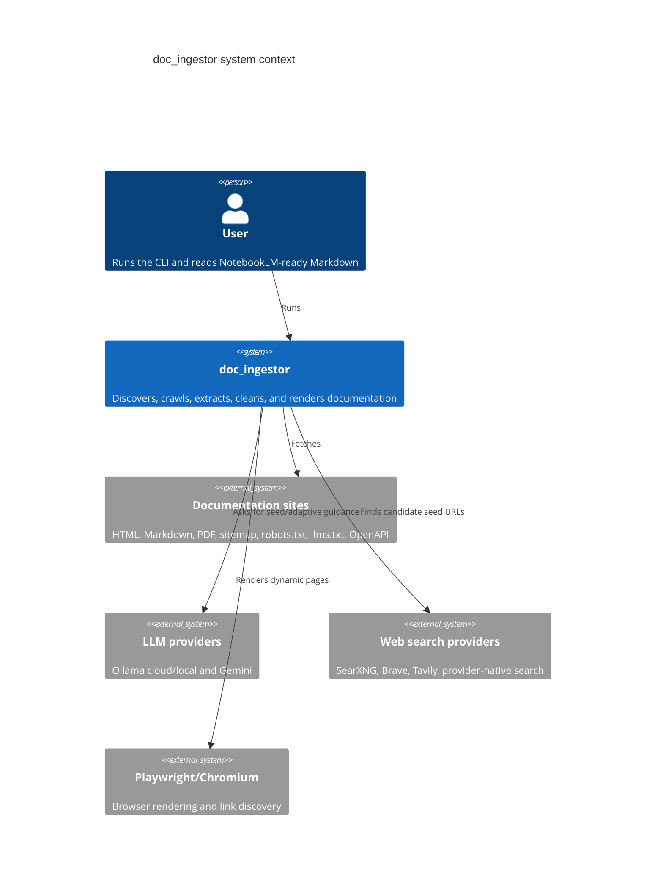
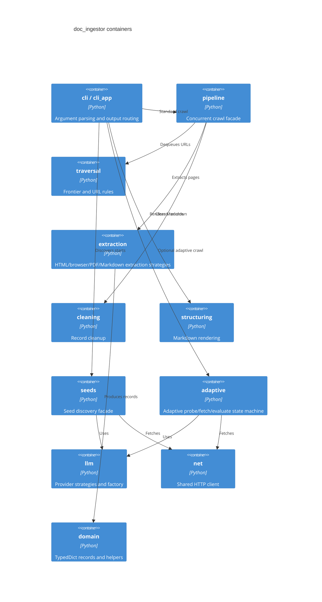
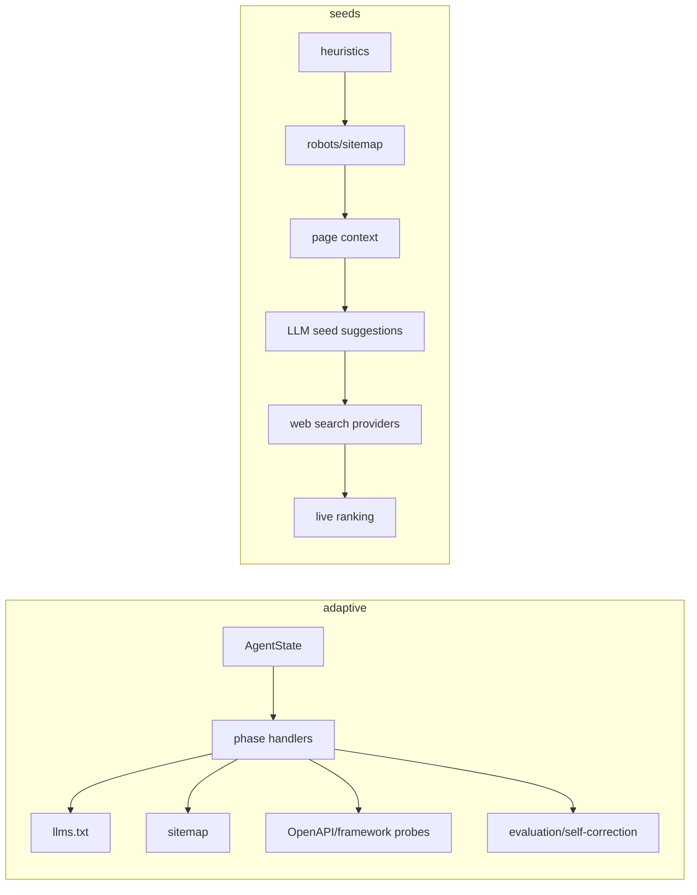
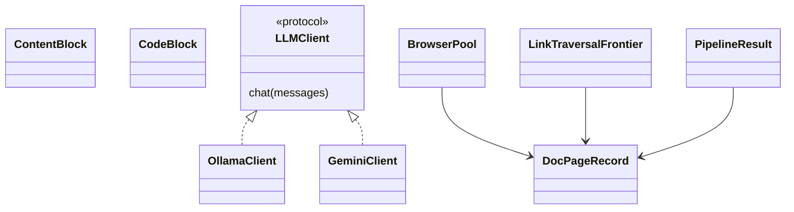

# Architecture

This refactor keeps the public CLI and import surface stable while organizing the crawler
behind layered package facades.

## C1 System Context

## C2 Containers

## C3 Components

## C4 Code

