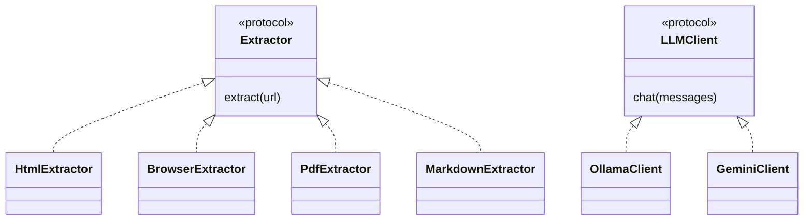
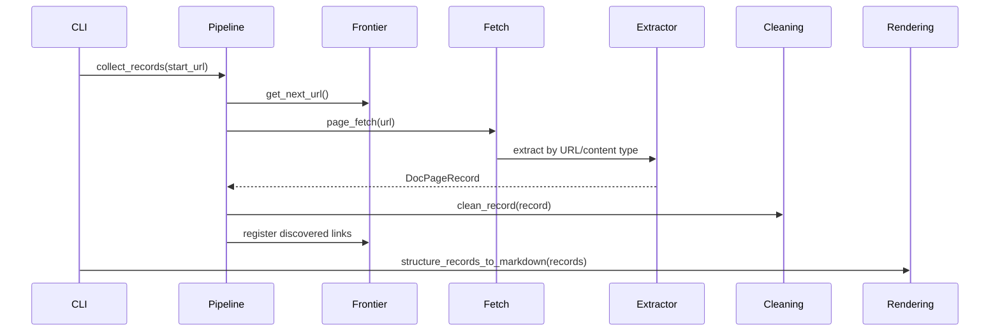
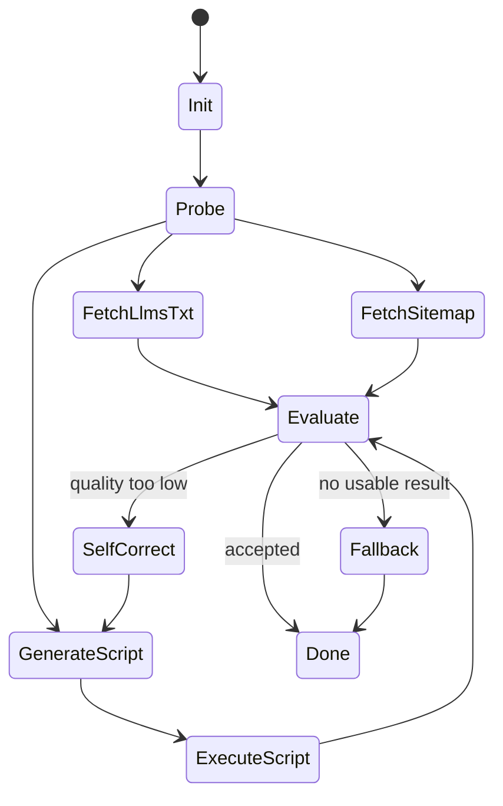
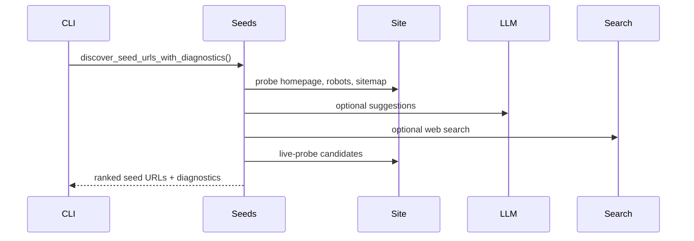

# Design

The codebase uses small facades to preserve the old imports while moving shared concerns
into focused packages.

## Strategy Families

## Standard Crawl

## Adaptive State

## Seed Discovery

